### ❓ who am I?

hey 👋 :D! I'm nyxion! I'm a dev who enjoys coding stuff that pops into my head.
currently, I'm working on my [pmm updater program](https://github.com/nyxion-luna/pmm).

<a href='https://github.com/nyxion-luna/pmm'>
  <picture>
    <source
        srcset="./cards/pmm-pin.svg"
        media="(prefers-color-scheme: dark)"
    />
    
  </picture>
</a>

languages I know:

- 🐍 python
- 📄 html
- 🎨 css
- 🐚 shell

languages on my to-learn list:

- 🦀 rust
- ☕ java
- 🟨 javascript

### 💻 my setup

- 🐧 [kUbuntu](https://kubuntu.org/) (if you're using Windows and wanna switch, check out [distrochooser](https://distrochooser.de/))
- 🐱 [kitty](https://sw.kovidgoyal.net/kitty/)
- 🐟 [fish shell](https://fishshell.com/)
- 🌐 [zen browser](https://zen-browser.app/) with [sine](https://github.com/CosmoCreeper/Sine), a theme manager.

### 🌙 interests

- linux & customization
- game design & gaming
- open source software
- automation & coding
- making digital art

### ✨ a few stats!

  <a href="https://github-stats-extended.vercel.app/api?username=anuraghazra">
    <picture>
      <source
        srcset="./cards/stats.svg"
        media="(prefers-color-scheme: dark)"
      />
      
    </picture>
  </a>
  <a href="https://github-stats-extended.vercel.app/api/top-langs?username=anuraghazra&layout=compact&langs_count=8&card_width=320">
    <picture>
      <source
        srcset="./cards/top-langs.svg"
        media="(prefers-color-scheme: dark)"
      />
      
    </picture>
  </a>

🛈 thanks to [github-stats-extended](https://github.com/stats-organization/github-stats-extended/) for the [cards generator action](https://github.com/stats-organization/github-readme-stats-action)
